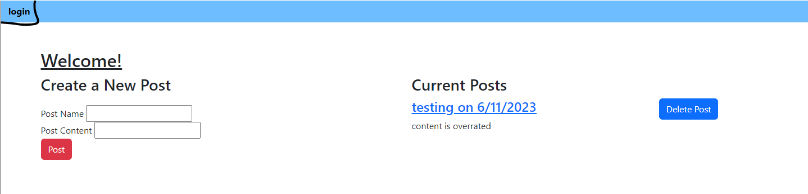
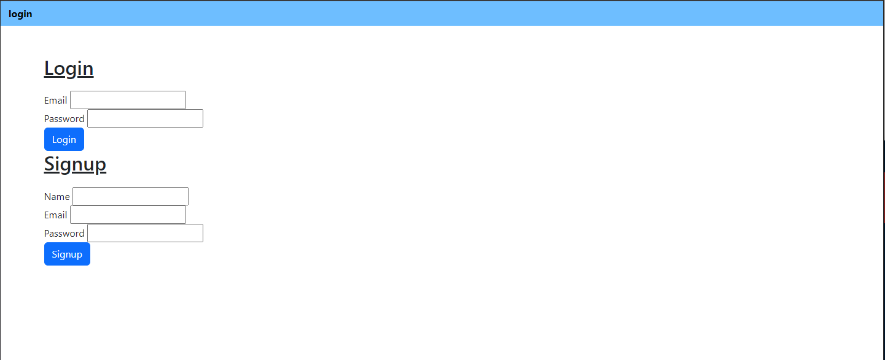
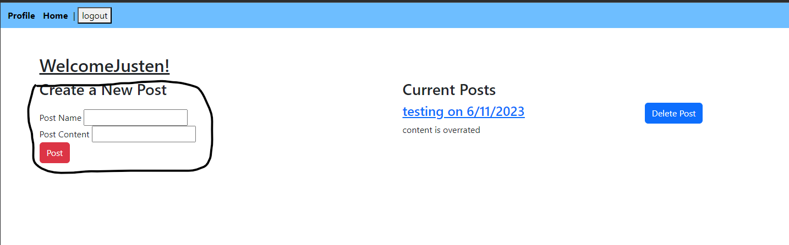

# blogblog

## Table of Contents

- [Project description](#Description)
- [Usage](#Usage)
- [Installation](#Installation)
- [Contributing](#Contributing)
- [Tests](#Tests)
- [Questions](#Questions)
- [Project License](#License)

## Description

A blog to write what you want to share.

## Usage

Click on Login.

Then Login or Sign up

Once logged in enter your posts name and content then click post.

## Installation

Visit the deployed application.

## Contribute

N\A

## Tests

N\A

## Questions

You can reach me with any questions below.

- [GitHub](https://github.com/Radioactive-mtb)
- Email - justen27@live.com

## License

This project is covered under the MIT license.
[MIT](https://choosealicense.com/licenses/mit)
